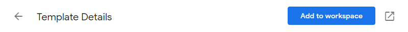
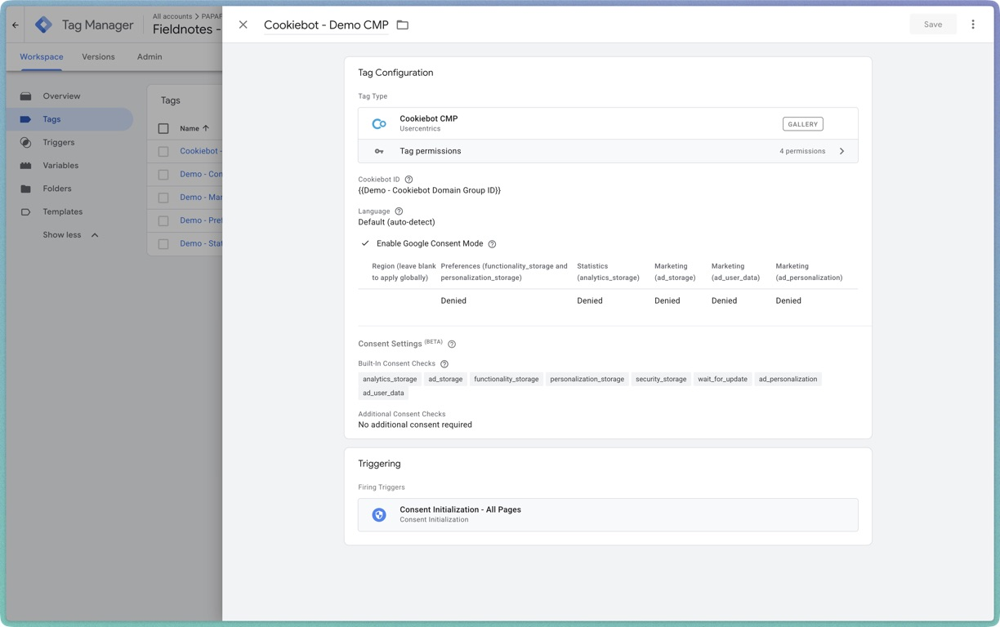
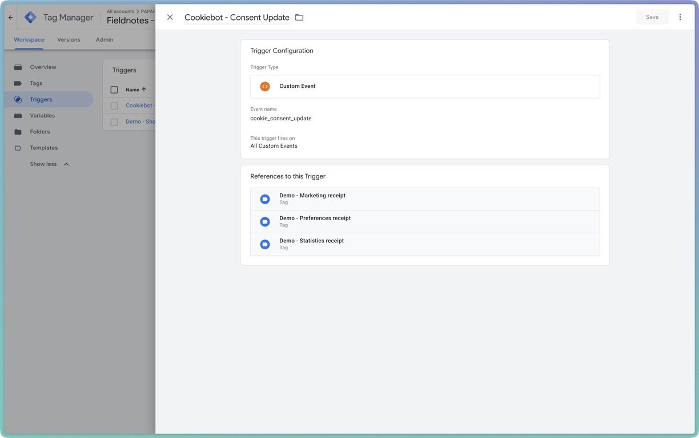
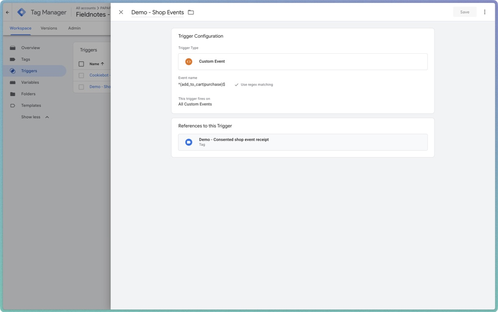
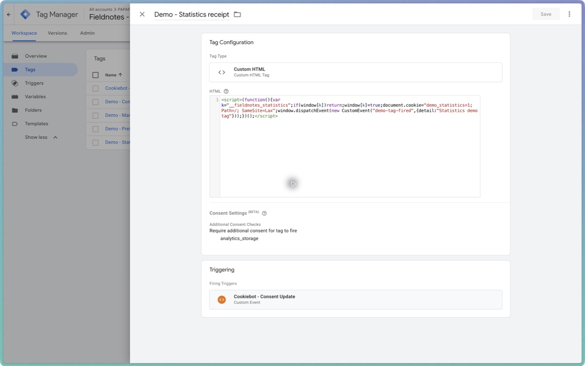
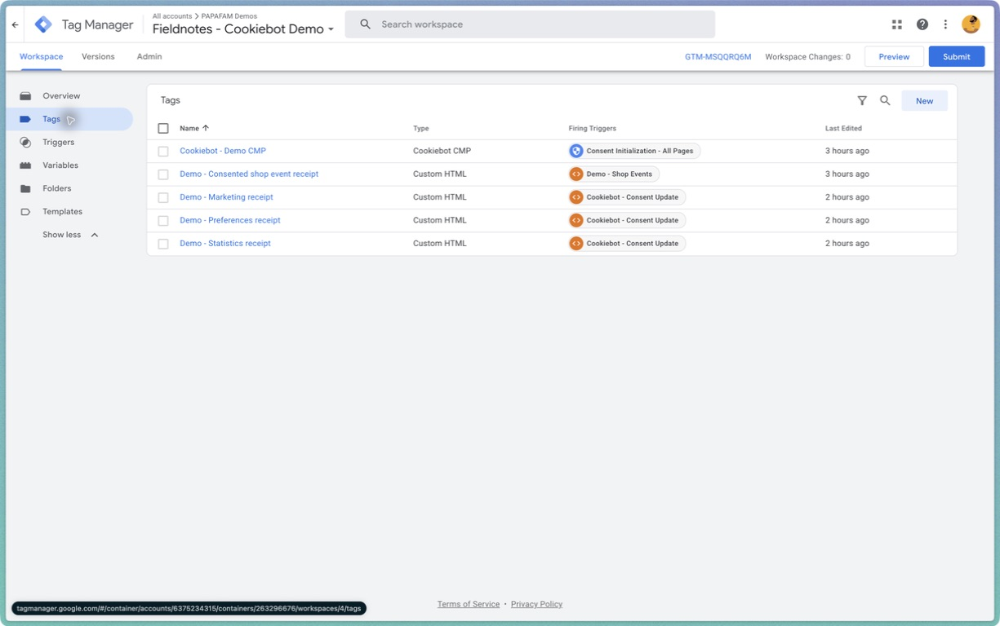
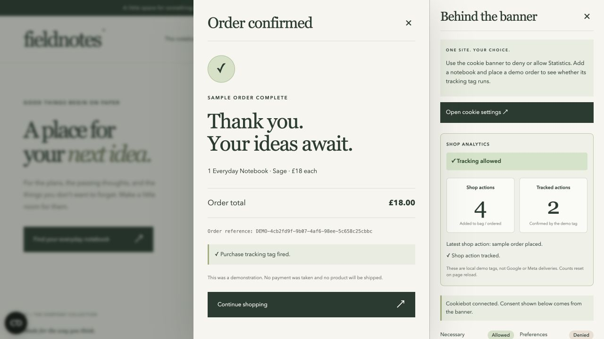
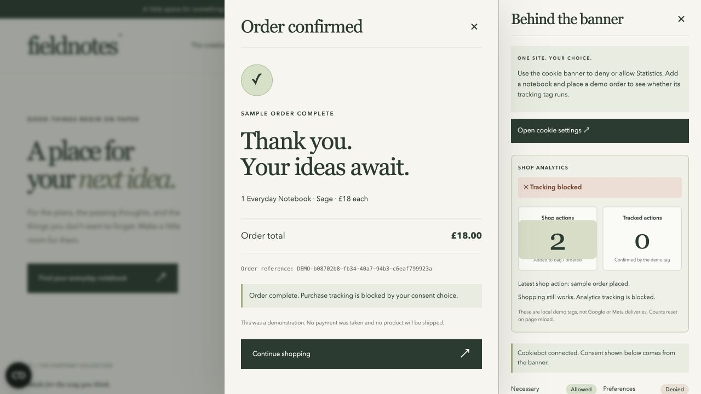

# Fieldnotes recording guide — manual setup and explanations

[← Back to the quick setup](README.md)

Use this guide when recording the tutorial or building the tags manually. **Use one container throughout:** demonstrate denied, granted and withdrawn consent by changing the banner choice. There is no unrestricted mode. For the shortest setup route, follow the README first.

**[Sign up for Cookiebot by Usercentrics](https://usercentrics.sjv.io/sonnysangha)** · [Live demo](https://fieldnotes-consent-demo-2026.vercel.app/)

The signup link is Sonny’s affiliate/referral link.

This guide covers the setup from an empty GTM container, the exact demonstration tags, a recording script, testing, troubleshooting and publishing. The storefront includes a shopping bag, sample order confirmation, Cookiebot settings and a docked live inspector.

> **What is real?** GTM loads and executes the tags. Cookiebot supplies consent choices. GTM's additional consent checks gate execution. The page receives a receipt only when a demo tag actually runs. **What is simulated?** The shop and its orders are demonstrations. These tags do not send anything to GA4, Google Ads or Meta. A receipt proves demo-tag execution, not delivery to those platforms.

## Contents

1. [The story to teach](#1-the-story-to-teach) — [installation choices](#choose-the-installation-before-opening-gtm), [quick script route](#the-quickest-route-to-demonstrate-the-direct-script), [Consent Mode](#where-google-consent-mode-fits), [why each setting matters](#why-each-setup-choice-matters)
2. [Prepare for the recording](#2-prepare-for-the-recording)
3. [Understand the existing demo](#3-understand-the-existing-demo)
4. [Run your own copy](#4-run-your-own-copy)
5. [Set up Cookiebot](#5-set-up-cookiebot)
6. [Create the GTM containers](#6-create-the-gtm-containers)
7. [Build the container on camera](#7-build-the-container-on-camera)
8. [Check the tag inventory](#8-check-the-tag-inventory)
9. [Import shortcut](#9-import-shortcut)
10. [Preview and verify in Tag Assistant](#10-preview-and-verify-in-tag-assistant)
11. [Record the consent demonstration](#11-record-the-consent-demonstration)
12. [Publish and retest](#12-publish-and-retest)
13. [Cookie declaration and scan](#13-cookie-declaration-and-scan)
14. [Answers to explain on camera](#14-answers-to-explain-on-camera)
15. [Optional real GA4 extension](#15-optional-real-ga4-extension)
16. [Troubleshooting](#16-troubleshooting)
17. [Screenshots and shot list](#17-screenshots-and-shot-list)
18. [Copy-and-paste tag code](#18-copy-and-paste-tag-code)

## 1. The story to teach

**Say:**

> “I've built a small notebook shop. People can browse, add things to their bag and place a sample order. But being able to shop doesn't mean they've agreed to analytics or marketing tracking. Let's connect Cookiebot to Google Tag Manager and make that difference visible.”

The sequence is:

```text
Visitor chooses consent in Cookiebot
                    ↓
Cookiebot updates GTM consent state
                    ↓
Shop sends an add_to_cart or purchase event to dataLayer
                    ↓
GTM checks the matching trigger AND the required consent
              ↙                         ↘
Consent denied                       Consent granted
Tag does not run                     Demo tag runs
No receipt                           “Tag fired” receipt
```

**Three separate concepts:**

| Thing | What it does in this project |
|---|---|
| Cookiebot CMP banner | Shows the choices and communicates the visitor's consent state. |
| GTM trigger | Decides which event makes a tag eligible to run. |
| Additional consent check | Decides whether that eligible tag is permitted to run. |

**Say:**

> “The trigger is when to try. The consent check is whether it's allowed.”

For this video, teach waiting for consent. Google distinguishes Basic mode, which blocks Google tags before consent, from Advanced mode, which loads Google tags under denied defaults and can send cookieless pings. This project demonstrates consent-gated custom tags; it does not demonstrate Google's cookieless measurement. [Google's consent-mode overview](https://developers.google.com/tag-platform/security/concepts/consent-mode).

### Choose the installation before opening GTM

**Opening explanation to read on camera:**

> “Start with where your tracking is installed. If you can edit your website header and want the quickest starting point, Cookiebot's direct script with automatic blocking is the route to show first. If your tags already live in Google Tag Manager, GTM gives you one place to configure and inspect their consent rules. Google Consent Mode adds another layer: it tells supported Google tags how to behave based on the visitor's choice. It isn't an alternative banner.”

Treat this as **two decisions**, not three competing products:

1. **Where does Cookiebot load, and what controls the scripts?** Direct installation, a platform plugin, or a GTM installation.
2. **If you use Google measurement, what should happen before permission?** Basic or Advanced Consent Mode.

| Option | Value to explain | What the viewer must still do |
|---|---|---|
| Direct script + automatic blocking | My quickest starting route for a simple website with access to its header. Cookiebot handles the banner and uses its blocking configuration to control identified cookie-setting resources. | Place it correctly, complete/review the scan, classify resources and test the site's real integrations. |
| Platform plugin/integration | Useful when the CMS offers a supported installation flow and you prefer its settings screen to editing a template. | Follow that platform's coverage instructions; verify landing pages and checkout as well as the homepage. |
| Cookiebot through GTM | Useful when tags already live in GTM. You can inspect the trigger, consent requirement and execution result together, and version the configuration. | Configure each tag appropriately; account for scripts outside the container. This is the route used in Fieldnotes. |
| Direct auto-blocking + GTM | Useful for a mixed site with both embedded scripts and GTM-managed tags. | Follow the combined installation instructions, including script order and exclusions; install the CMP only once. |
| Direct script + manual blocking | Useful when a developer needs explicit control over individual embeds or scripts. | Disable each relevant resource initially and add the required consent markup or application logic. |

These are workflow choices, not promises that any route completes every site's consent work automatically. Cookiebot documents both [automatic blocking](https://support.cookiebot.com/hc/en-us/articles/360009074960-Automatic-cookie-blocking) and [manual blocking](https://support.cookiebot.com/hc/en-us/articles/4405978132242-Manual-cookie-blocking).

### The quickest route to demonstrate: the direct script

**Show this on a separate simple page, not inside this project's GTM-based installation.**

1. Register the deployed hostname and configure its banner in Cookiebot.
2. Open **Implementation → CMP Banner → Auto blocking** and copy the generated script for that domain group.
3. For the standalone route, put it as the first script in the site's `<head>`, before cookie-setting resources. Keep automatic blocking enabled; do not add `async` or `defer` to that script.
4. Publish the website. Check the actual rendered page, not only the editor field.
5. Review the completed scan, classifications and any reported blocking issues.
6. Test before consent, after a category grant and after withdrawal. Use browser storage **and** network requests; absence of a cookie alone does not prove absence of data transmission.

**Say:**

> “This is the quickest install I'm showing: copy the auto-blocking script into the header, then verify it. Automatic blocking uses Cookiebot's scan and classifications to identify the resources it should hold back. Copying the script is the installation step; checking what actually loads is the proof.”

Resources that already ran before the blocker cannot be retrospectively prevented. Server-set cookies need server-side handling. [Cookiebot automatic-blocking instructions and troubleshooting](https://support.cookiebot.com/hc/en-us/articles/360009074960-Automatic-cookie-blocking).

**A mixed GTM site needs its own recipe.** Cookiebot's combined guide specifies denied Consent Mode defaults, then GTM, then the auto-blocking CMP script, with the consent-default and GTM scripts marked `data-cookieconsent="ignore"`. Its GTM CMP tag must not also load Cookiebot. Keep consent controls on the tracking tags within GTM; allowing the container loader to run is not permission for every tag. [Combined auto-blocking and GTM installation](https://support.cookiebot.com/hc/en-us/articles/360009192739-Google-Tag-Manager-and-Automatic-cookie-blocking).

For this video, explain that mixed route briefly and continue with the isolated Fieldnotes GTM route. Don't splice the standalone script instructions into the GTM build halfway through.

### Why use GTM for this demonstration?

Our teaching goal is to make **an attempted purchase event and an executed tracking tag visibly different**. The site's event log and GTM Preview give us two views of the same action.

**Say:**

> “GTM is useful here because I can show the rule next to the tag. When someone buys a notebook, the shop reports a purchase internally. GTM then checks whether our analytics demonstration tag is allowed to run. The purchase still works if the visitor says no.”

In Fieldnotes, all optional demonstration tags are deliberately inside GTM. We use the official CMP template to supply consent state and explicit additional checks to gate the four custom tags. No direct auto-blocking script is installed in this route. A real site's external video embeds, CMS integrations or hard-coded pixels would need separate review and controls; moving the banner into GTM does not move those resources into GTM.

### Where Google Consent Mode fits

Consent Mode communicates choices to supported Google measurement tags. Its value is that Google's measurement behavior can respond to those choices. It does not provide the banner, and it does not automatically make an unrelated Meta pixel or custom HTML script consent-aware. GTM is optional for Consent Mode: a direct Google-tag installation can also implement it. [Google's consent implementation guide](https://developers.google.com/tag-platform/security/guides/consent).

| Google behavior | Before relevant consent is granted | Why a site might choose it |
|---|---|---|
| Basic | Google measurement tags are held back; denied visitors do not send measurement through those tags. | The desired behavior is to wait for permission before starting Google measurement. |
| Advanced | Google tags can load with denied defaults and send cookieless measurements. Granted categories change their behavior. | The site wants consent-aware measurement with additional signals for modeling, including when storage is denied. |

Advanced is a different data-collection choice, not simply a better installation. Cookieless does not mean no data is sent. Modeling is estimation, not recovery of every individual visitor's actions. [Google's Basic/Advanced comparison](https://developers.google.com/tag-platform/security/concepts/consent-mode).

**Say:**

> “We're teaching a wait-for-permission experience. With Google measurement, that's the Basic direction. Advanced can still send cookieless signals when consent is denied. Our core demo uses local tags so you can see the blocking without sending sample purchases into a real analytics account.”

**V2 is a separate distinction from Basic/Advanced.** V2 added `ad_user_data` and `ad_personalization` alongside the established `ad_storage` and `analytics_storage` signals. Check all four in Tag Assistant: defaults must be set early and updates must reflect the visitor's choices. Seeing a banner or a `G-…` measurement ID alone doesn't confirm V2. [Google's V2 setup guidance](https://developers.google.com/tag-platform/security/guides/consent).

### Explain the blocking with one purchase

Use this exact Fieldnotes example while the inspector is open:

| Stage | What happens | What to point at |
|---|---|---|
| Before choosing | Optional consent starts denied for this demo. | Cookiebot and the inspector's category states. |
| Add one notebook and order | The shop completes the £18 sample order and pushes its internal `purchase` event. | Thank-you screen and `purchase → dataLayer`. |
| GTM evaluates the event | `Demo - Shop Events` matches `purchase`; the shop receipt tag requires `analytics_storage`. | The trigger and consent requirement in GTM. |
| Statistics denied | GTM does not execute that tag. | No purchase Tag fired receipt; tracked-action count stays zero. |
| Grant Statistics and make a new order | The same rule now permits the tag; it dispatches a local receipt. | Purchase Tag fired badge and increased tracked-action count. |
| Withdraw and make another order | This app clears its three demo cookies and reloads; future shop receipts are blocked again. | Fresh denied state, successful order and zero tracked actions. |

**Say:**

> “A dataLayer event says something happened in the shop. A Tag fired badge says our GTM tag actually executed. The consent check sits between those two things. That's why you can still see purchase after rejecting analytics.”

The blocked events in this project are not replayed after a later grant. Its withdrawal reload is explicit application code, not a feature to assume every banner installation implements. Section 11 gives the exact recording sequence and counter expectations.

### Why each setup choice matters

Use these explanations while following section 7, rather than reading unexplained settings aloud:

| Setup choice in this demo | Reason to explain | Mistake it helps avoid |
|---|---|---|
| Correct domain group and hostname | The banner must use the configuration intended for this site. | Testing the wrong banner or an unauthorized hostname. |
| CMP on Consent Initialization | Consent setup gets an early execution opportunity. | Measurement starting before its consent state is established. |
| No optional-consent gate on the CMP | Visitors need the banner to make their first choice. | A banner waiting for permission that visitors cannot give. |
| Optional defaults denied | This experiment starts with optional tracking off. | Treating silence as a grant. |
| `cookie_consent_update` for category tags | These tags get an opportunity after choices are available. | A denied All Pages attempt never retrying on that first page. |
| `analytics_storage` on Statistics and shop receipts | Those examples represent statistical tracking. | Confusing an event name with a permission name. |
| `ad_storage` on the marketing example | That example writes a marketing-category demo cookie. | Calling every optional tag “analytics.” |
| `functionality_storage` on the preferences example | It represents optional preference storage. | Bundling optional preferences into necessary storage. |
| Exact shop-event regex | Only additions and purchases trigger this receipt tag. | Counting consent updates as purchases or shop actions. |
| Successful category guard; shop tag once per event | Initialize each permitted demo category once, but measure each new shop action. | Duplicate initialization or only one tracked action per page. |
| Preview, then publish, then retest | Draft configuration and public configuration can differ. | Showing a successful preview while visitors receive old tags. |

The table explains this project's configuration. For the general mechanics of initialization, built-in checks and additional firing requirements, see [Google's GTM consent controls](https://support.google.com/tagmanager/answer/10718549). A built-in Google consent check can adapt behavior; an additional check can prevent firing. That distinction is why a Basic setup can need a gate even when a Google tag already lists built-in checks.

### The finish line to explain to viewers

**Say:**

> “We haven't finished just because the banner appears. We finish when the right tags stay blocked before permission, the right category starts them after permission, each action is counted once, and changing your choice affects future tracking. Then we publish and repeat the checks on the public site.”

For a real analytics extension, add one more proof: inspect the destination's requests and debug view for the correct event, value, currency and transaction ID. A local receipt alone cannot establish that Google Analytics or Meta received the purchase. Keep one deliberate delivery path for each destination; audit native CMS integrations alongside GTM before enabling a second copy.


## 2. Prepare for the recording

Use a desktop browser wide enough to show the storefront and the right-hand inspector. On narrow screens the inspector docks at the bottom. It scrolls independently from the shop.

Have these tabs ready:

- Your demo site.
- Google Tag Manager, in the **demo account**, not your production account.
- Cookiebot admin, showing the demo hostname.
- Tag Assistant, opened by GTM Preview.

Before filming:

1. Rehearse once before recording the setup.
2. Use a dedicated demo hostname and demo GTM containers. Do not modify a production container to make the recording look fresh.
3. If reshooting from scratch, create fresh rehearsal containers and point a separate copy of this site at them. Leave the working public demo intact.
4. Confirm your banner applies to your recording location. Choose settings intentionally for the demo; do not teach that one geographic policy suits every website.
5. Check that content blockers aren't preventing GTM itself from loading.
6. Clear or withdraw previous consent before the denied-consent take.
7. Close personal account menus before filming.

**Suggested edit structure:** hook → direct-script quick start → installation choices → Basic/Advanced explanation → why this demo uses GTM → container setup with reasons → denied test → accepted test → withdrawal → recap. Keep the optional GA4 discussion after the core demo.

## 3. Understand the existing demo

The hosted example loads one web container: **Fieldnotes - Cookiebot Demo (`GTM-MSQQRQ6M`)**. That container contains Cookiebot and the four consent-controlled demonstration tags. Use your own container ID for a clone.

The same container handles every visit and consent choice. Legacy mode query parameters cannot select a different container. Its tags stay installed when consent changes; the consent checks determine whether they execute.

The inspector is custom code in this project, not a standard Cookiebot feature:

- **Tracking blocked / allowed** describes the Statistics permission used by shop analytics.
- **Shop actions** counts additions and sample purchases on the current page.
- **Tracked actions** counts actual shop-tag receipts. It excludes the three category initialization tags.
- **Local tag receipts** in the detailed section includes category tags as well as shop tags.
- **Tag fired** badges are attached only to actual `demo-tag-fired` callbacks.
- A plain `purchase → dataLayer` row records an internal shop action. It is not evidence that a tracking tag fired.
- The three demo cookie names are `demo_statistics`, `demo_marketing`, and `demo_preferences`.

## 4. Run your own copy

Clone the source, then work inside the repository root:

```bash
git clone https://github.com/sonnysangha/fieldnotes-cookiebot-gtm-demo.git
cd fieldnotes-cookiebot-gtm-demo
```

Use Node.js 24.15+. This is a Next.js 16 + TypeScript app. Install dependencies before running it.

```bash
npm install
npm run dev
```

Open `http://localhost:3000/`. Next.js serves the app; static assets live in `public/`.

```bash
npm test
npm run build
```

The Next.js build appears in `.next/`. Use `npm start` to serve the production build locally, or deploy the repository with the Next.js preset on Vercel.

For Vercel: import your repository and select the Next.js preset. Add your hostname in Cookiebot and supply the three environment variables below in Project Settings → Environment Variables. Then redeploy. GTM tag changes require a GTM publish; app or environment changes require a site rebuild and redeploy.

Copy `.env.example` to `.env.local` for local development:

```dotenv
NEXT_PUBLIC_GTM_ID=GTM-YOURID
NEXT_PUBLIC_COOKIEBOT_ID=YOUR-COOKIEBOT-DOMAIN-GROUP-ID
NEXT_PUBLIC_ALLOWED_HOSTS=localhost,127.0.0.1,your-demo-domain.vercel.app
```

The values are public browser identifiers, not secrets. Keep real credentials out of `NEXT_PUBLIC_` variables. Restart the dev server after edits.

**Do not paste a second GTM snippet into this project.** `src/app/layout.tsx` mounts `GtmLoader` inside `DemoProvider`. The loader loads it once with `next/script` (`afterInteractive`), after the adapter initializes `dataLayer` and subscribes to Cookiebot events. For an ordinary website without this loader, use the snippets from GTM's installation screen: head code high in `<head>` and the provided noscript code immediately after `<body>`. [Google's installation guide](https://support.google.com/tagmanager/answer/14842164).

This demo requires JavaScript and does not implement a noscript tracking path. It includes no server checkout, payment form, analytics destination or Meta pixel.

**Say:**

> “This demo already has the GTM loader. On your own site, install your container once using the instructions for your platform. Installing the banner twice or installing the same container twice will make testing confusing.”

## 5. Set up Cookiebot

1. [Create or open your Cookiebot account](https://usercentrics.sjv.io/sonnysangha).
2. In **Domains & Aliases**, register your own deployed demo hostname.
3. Choose the intended domain group and copy its Domain Group ID.
4. Configure the banner text and choices for the demo. Make the relevant categories available and leave optional choices off for the initial test.
5. Save the configuration and check the banner's availability for the recording location.
6. Open **Implementation**. Use the Google Tag Manager installation route for this build.
7. Monitor **Cookies & Reports** for the domain scan. Do not call the inventory complete until a completed scan and its results are visible.

What the Implementation tabs mean:

| Tab | Your action for this demo |
|---|---|
| CMP Banner | Use the GTM template route below to load the banner. Don't also paste the direct CMP script into the page. |
| Cookie declaration | Publish the declaration in the body of a cookie-information page or section. This demo already includes a footer control for it. |
| Google Consent Mode | Check the integration settings. The GTM template used here enables consent signaling. This is not a second banner. |
| A/B Testing | Not needed for this installation or blocking demonstration. |

Reference: [Cookiebot's GTM deployment guide](https://support.cookiebot.com/hc/en-us/articles/360003793854-Google-Tag-Manager-deployment).

**Say:**

> “Cookiebot is where the visitor makes the choice. For this setup, GTM loads Cookiebot and uses that choice to control the other tags.”

## 6. Create the GTM containers

If you already have a demo account, reuse it. Otherwise use **Create Account**, enter your demo account details and complete Google's account setup.

Create one **Web** container named `Fieldnotes - Cookiebot Demo` for the core tutorial. Copy its `GTM-…` ID into `NEXT_PUBLIC_GTM_ID` and open the normal site URL. Rebuild and redeploy after changing configuration.


In the demo container, enable **Admin → Container Settings → Additional Settings → Enable consent overview → Save**. The overview is accessible from the Tags screen. [Google's consent-settings reference](https://support.google.com/tagmanager/answer/10718549).

**Recording tip:** show the container name and ID before each setup section. Use the same container for every consent scenario.

## 7. Build the container on camera

These steps reproduce the project's supplied container configuration. UI labels can vary slightly as the GTM template updates.

### A. Add the Cookiebot template and ID variable

1. Open **Templates → Tag Templates → Search Gallery**.
2. Search for **Cookiebot CMP** and select the official Usercentrics template.
3. Review the template information and add it to the workspace.
4. Open **Variables → User-Defined Variables → New**.
5. Name it `Demo - Cookiebot Domain Group ID`.
6. Choose **Constant** as the variable type.
7. Enter the Domain Group ID from your Cookiebot account and save.



*Official Cookiebot reference screenshot — Use Add to workspace after selecting the official template. [Source: Cookiebot GTM deployment guide](https://support.cookiebot.com/hc/en-us/articles/360003793854-Google-Tag-Manager-deployment). These examples are not captures of the Fieldnotes container.*

### B. Create the CMP tag

1. **Tags → New**.
2. Name: `Cookiebot - Demo CMP`.
3. Tag Configuration: **Cookiebot CMP**.
4. Cookiebot ID: choose `{{Demo - Cookiebot Domain Group ID}}`.
5. Keep **Google Consent Mode enabled**. In the template captured in this project, Advertiser Consent Mode is also enabled.
6. Create a global default-consent row: leave Region blank; set Preferences, Statistics, Marketing, marketing ad-user-data and marketing ad-personalization to **denied**.
7. The captured settings use automatic language, `.com` CDN, wait for update `2000`, URL passthrough off, dynamic ads-data redaction, and IAB/TCF off. These reproduce this demo, not a recommendation for every production site. Leave unrelated optional template features alone unless your use case requires them.
8. Trigger: **Consent Initialization – All Pages**.
9. Additional consent: **No additional consent required** for the CMP itself.
10. Save.



*Actual Fieldnotes GTM capture from Arc, 5 September 2026. The CMP uses the Domain Group ID constant, optional defaults are denied, Google Consent Mode is enabled, and its trigger is Consent Initialization – All Pages. The CMP itself requires no additional consent.*

The CMP must be able to load before a visitor has granted optional consent. Do not require `analytics_storage` for the banner itself.

**Say:**

> “The banner goes on Consent Initialization. The optional tags start from denied. Once the visitor makes a choice, Cookiebot updates the consent state that GTM uses.”

### C. Create the consent-update trigger

1. **Triggers → New**.
2. Name: `Cookiebot - Consent Update`.
3. Type: **Custom Event**.
4. Event name: `cookie_consent_update`.
5. Leave regular-expression matching off.
6. Choose **All Custom Events** for this named event.
7. Save.



*Actual Fieldnotes GTM capture. The event name is `cookie_consent_update`; the references show the three category tags that use this trigger.*

This is the trigger for the category initialization tags. An All Pages trigger alone would not give them another opportunity when someone first grants consent later on that same page.

### D. Create the shop-event trigger

1. **Triggers → New**.
2. Name: `Demo - Shop Events`.
3. Type: **Custom Event**.
4. Event name: `^(add_to_cart|purchase)$`.
5. Enable **Use regex matching**.
6. Choose **All Custom Events** for the matching expression.
7. Save.



*Actual Fieldnotes GTM capture. This trigger matches the two shop events and references the single consented shop receipt tag.*

The anchors ensure the names match exactly. This intentionally excludes consent events, page-lifecycle events and `remove_from_cart`. The shop does push removal events, but the demo tracking counter covers additions and purchases only.

### E. Create the four demonstration tags

For each row: **Tags → New → Custom HTML**, paste the corresponding code from section 18, select its trigger, and set **Advanced Settings → Tag firing options → Once per event**.

Then open **Advanced Settings → Consent Settings → Require additional consent for tag to fire**, and enter the required consent type exactly.

| Tag name | Trigger | Required consent |
|---|---|---|
| `Demo - Statistics receipt` | Cookiebot - Consent Update | `analytics_storage` |
| `Demo - Marketing receipt` | Cookiebot - Consent Update | `ad_storage` |
| `Demo - Preferences receipt` | Cookiebot - Consent Update | `functionality_storage` |
| `Demo - Consented shop event receipt` | Demo - Shop Events | `analytics_storage` |



*Actual Fieldnotes GTM capture. Show the `analytics_storage` requirement and `Cookiebot - Consent Update` trigger together: the first controls permission, the second controls when to try.*

The three category scripts contain a per-page guard. That guard is set only after the tag is permitted to execute. Repeated consent updates can retry a previously blocked category without executing a successful category twice. Keep **Once per event**; using once-per-page caused a failed retry in this particular demo's earlier testing.

The shop tag has no once-per-page guard because it must run for every permitted addition and purchase.

These are artificial category cookies. A production tag's required permissions must reflect that tag's behavior; don't use `analytics_storage` for every tag simply because it is familiar.

**Say:**

> “This Statistics tag needs analytics_storage. Its trigger says when it can run, and this consent field says whether it's allowed. Our marketing and preferences examples use their own categories.”

### F. Review before previewing



*Actual Fieldnotes GTM capture. Compare your rebuilt tag inventory against these five tags.*

The demo container should contain exactly **five tags**, **two custom triggers**, and the Cookiebot ID constant. Cookiebot runs on the built-in Consent Initialization trigger. No GA4, Ads, Meta, Hotjar, chat widget or production tag should appear in this isolated example.

Open Consent Overview and show the required permission for each of the four demo tags. The CMP should not wait for optional consent.

## 8. Check the tag inventory

Before Preview, confirm you have five tags: the CMP and four custom receipt tags. Confirm the CMP uses Consent Initialization and no optional permission gate. The other four tags must require their documented consent categories.

Do not add an unrestricted duplicate or bypass URL. Test with the same container by changing consent through Cookiebot. The storefront already installs GTM once.

## 9. Import shortcut

Use this for rehearsal or recovery. For the tutorial, manually build at least the CMP, consent trigger and one category tag so viewers understand the relationship.

Files included:

- [`gtm/demo-basic-consent.import.json`](gtm/demo-basic-consent.import.json)

In an **empty rehearsal container**:

1. Open **Admin → Import Container**.
2. Choose `demo-basic-consent.import.json`.
3. Select the intended workspace.
4. Use the import preview to inspect changes. In an existing workspace, use Merge and resolve naming conflicts deliberately; Overwrite can remove unrelated configuration.
5. Confirm the file adds five tags and two custom triggers.
6. Complete the import.
7. Set the imported Cookiebot ID constant to your real Domain Group ID.
8. Verify the official template, consent settings and triggers before Preview.
9. Set the three public environment variables from step 5 and deploy the site.

The public import files contain a placeholder Cookiebot ID and omit our account/container metadata. Importing does not publish a container. Do not import these files into your business's production container.

## 10. Preview and verify in Tag Assistant

The inspector is useful for the video; **Tag Assistant supplies the GTM-side check**.

1. In the demo GTM workspace click **Preview**.
2. Enter your site's normal deployed URL.
3. Connect and open the launched site. Use the same browser/session for actions and inspection.
4. Return to Tag Assistant and select **Fieldnotes - Cookiebot Demo**.
5. Select the consent initialization event and inspect the CMP tag and default consent state.
6. On the website choose Deny, add a notebook and place a sample order.
7. Back in Tag Assistant, select `add_to_cart` or `purchase` in the event timeline. Open the shop receipt tag. Confirm it did not fire because its required consent was not granted, rather than merely because its trigger did not match.
8. Check the Consent panel for the state at that event.
9. Grant Statistics on the site and repeat an addition. Select the new event in Tag Assistant. The shop receipt tag should now be in Tags Fired.
10. Inspect the purchase data-layer object: `currency: GBP`, `value`, `items`, quantity, and a unique `DEMO-…` transaction ID.

Google documents Preview as a way to inspect workspace behavior before publishing, and its consent debugger distinguishes default and updated consent state. [Preview guide](https://support.google.com/tagmanager/answer/6107056), [consent debugging guide](https://developers.google.com/tag-platform/security/guides/consent-debugging).

For Consent Mode V2, inspect these four values: `analytics_storage`, `ad_storage`, `ad_user_data`, `ad_personalization`. For this demo they begin denied; Statistics-only changes analytics consent while advertising consent remains denied. Presence of the V2 fields is not proof that a GA4 or Ads destination received data.

**Record:** the denied event's consent state and non-fired tag, then the granted event's fired tag. Do not use a screenshot of “Tags Not Fired” alone as proof: a tag can also be absent because its trigger never matched.

## 11. Record the consent demonstration

### Take 1 — introduce the setup and reset consent

**Do:** open the normal site URL and the Behind the banner panel. Withdraw any saved consent, let the page reload, and choose Deny if the banner needs a choice.

**Say:**

> “This is one normal GTM installation. I will keep the tags in place and change only my consent. First I will decline, then allow Statistics, then withdraw again.”

### Take 2 — prove blocking

**Do:** with Statistics denied, add twice and place one order.

**Show:** Shop actions **3**, Tracked actions **0**. No three optional demo cookies. £36 thank-you confirmation, with purchase tracking blocked. The detailed log still contains the shop events, but no Tag fired badges for them.

**Say:**

> “The customer can still complete an order. We have three shop actions, but zero tracked actions. The purchase exists inside the website; the tracking tag was not allowed to run.”

### Take 3 — grant Statistics on the same page

**Do:** continue shopping, open cookie settings, enable **Statistics only**, and choose Allow selection. Add one notebook, then place a sample order.

**Show:** the status turns Tracking allowed. The counters become **5 shop actions / 2 tracked actions** because the three earlier actions were blocked. The latest order is £18. Only `demo_statistics` appears. The Statistics initialization receipt is separate from the shop counter.

**Say:**

> “Now I've agreed to Statistics. New shop actions can run our analytics demonstration tag. The earlier blocked events weren't silently counted as tracked.”

The current demo does not replay purchases that happened while consent was denied. A different implementation could choose a different event pipeline; don't imply replay is a Cookiebot default.

### Take 4 — withdraw again

**Do:** close the order, click Withdraw consent, wait for reload, add once and place a sample order.

**Show:** **2 shop actions / 0 tracked actions**, Tracking blocked, £18 order, no optional demo cookies.

**Say:**

> “I've changed my mind. Future tracking is blocked again, but shopping still works.”

This site's withdrawal handler explicitly clears the three demo cookies and reloads when an optional category is reduced. The reload unloads already-started page code and resets counters. Don't promise that adding any banner automatically deletes every cookie or reverses data already sent.

### Optional quick checks

| Test | Expected result |
|---|---|
| Statistics only | Shop events can produce receipts; marketing and preference tags remain gated. |
| Marketing only after reset | Marketing cookie/receipt appears; shop tracking remains at zero. |
| Preferences only after reset | Preferences cookie/receipt appears; shop tracking remains at zero. |
| Save the same grant again | No extra successful category initialization receipt. |
| Reload with a saved grant | Consent is restored; category tags initialize once for the new page. |
| Click an empty-bag order again | No new purchase; the completed-order view has no repeat-submit button. |

## 12. Publish and retest

Once Preview behaves correctly, use **Submit**, give the container version a descriptive name, review the changes, and publish. There is only one container to publish.

Example version names:

- `Cookiebot — consent-gated demo receipts`

Then retest the public site outside Preview. Preview can show draft behavior that ordinary visitors do not receive. Check the loaded container ID if a result seems stale.

## 13. Cookie declaration and scan

The footer's **Cookie declaration** control adds the declaration into the page body using the configured Cookiebot ID. It is supplementary information, not the banner itself.

```html
<script id="CookieDeclaration"
  src="https://consent.cookiebot.com/YOUR-DOMAIN-GROUP-ID/cd.js"
  type="text/javascript"></script>
```

Use a dedicated page or appropriate body section on a normal website and provide a visible link to it. For this project, use the existing footer control rather than installing a second declaration loader.

The last verified demo declaration contained the standard CookieConsent entry; a completed full scan inventory was not verified. Before filming a scan result, open Cookiebot's reports and confirm the current domain, completion status, results and classification. A rendered declaration is not proof of a completed cookie audit.

## 14. Answers to explain on camera

**Why analytics_storage instead of cookie_consent_update?**

> “They do different jobs. cookie_consent_update is an event that makes GTM reconsider the tag. analytics_storage is the permission our Statistics tag requires.”

**Does installing the CMP automatically block every tag?**

> “In this GTM setup, we explicitly configure the tags' consent requirements. A script that is hard-coded outside GTM needs its own consent-aware implementation. A visible banner by itself isn't proof that tracking is blocked.”

**Why add a check when a Google tag has built-in checks?**

Built-in checks can change how supported Google tags behave rather than preventing loading. Additional checks gate firing. For a Basic demonstration, choose explicit pre-consent blocking; Advanced Google measurement is a separate explanation. [Google's tag consent settings](https://support.google.com/tagmanager/answer/10718549).

**Is the purchase sent to Google or Meta?**

> “Not in this isolated demo. GTM really runs or blocks our demonstration tag. That tag reports back to this page, which makes the result visible. A real analytics destination requires its own configuration and delivery verification.”

**Do I need another container for the test?**

> “No. We load one container and use the banner to change consent. The event is the same; the permission changes whether its tracking tag can run.”

**Why does the empty bag say zero after ordering?**

The bag is cleared, but the thank-you view preserves the completed order's quantity and total. Each later order gets its own transaction ID.

**Is a purchase badge a separate GA4 purchase tag?**

No. The same custom demo shop tag listens for both `add_to_cart` and `purchase`. The page labels its synchronous execution according to the current shop event. The badge is only added after the receipt callback. It is not an installed GA4 purchase tag.

## 15. Optional real GA4 extension

Keep this out of the core recording unless you want a longer integration tutorial. It is **not configured or verified in the supplied project**.

Use a separate demo GA4 property and web data stream. Add its Google tag to the demo container; for the intended Basic behavior, require `analytics_storage` and trigger it once consent is available. Add explicit GA4 event tags for additions and purchases, including their ecommerce parameters, with the same required Statistics consent. Ensure the Google tag initializes before event tags that depend on it.

Verify one page view per intended page, one event per action, correct currency/value/items, unique transaction IDs, denial and same-page consent transitions. Inspect actual requests and the destination's debugging interface; local receipts cannot establish ingestion. Don't reuse the production Kajabi measurement IDs.

For Meta, create an isolated test implementation, use the documented browser/server event and deduplication model, gate it on the appropriate marketing consent, and verify in Meta's tooling. Adding a Meta pixel is not equivalent to configuring Conversions API. No Meta or server-side setup is included here.

## 16. Troubleshooting

| What you see | Check |
|---|---|
| purchase in dataLayer after Deny | Expected internal event. Check Tracked actions, receipts and GTM's consent result. |
| No Tag fired badge after Allow | Verify trigger spelling, consent state at the event, actual GTM loading and correct container. |
| Category fires only after refresh | Confirm cookie_consent_update, Once per event and the successful-execution guard. |
| Three extra total receipts | Category initialization receipts are separate from the shop counter. |
| Banner missing | Verify domain registration, ID, geography, saved consent, published container and blocked network resources. |
| Two banners or duplicate events | Check for duplicate GTM loaders, direct CMP scripts, native platform integrations and repeated tags. |
| Wrong order total | Count is quantity × £18. New orders reset the bag; the order view keeps the completed total. |
| Counters reset | Full navigation/reload starts a new page. Withdrawal intentionally reloads this demo. |
| Scan inventory incomplete | Wait for and verify the actual report; don't infer scan completion from the banner. |

## 17. Screenshots and shot list

The app now uses Next.js 16 with strict TypeScript, a server-rendered storefront and a single `next/script` GTM loader. The screenshots below show the same retained storefront and GTM settings; they may predate the framework migration. Follow the test matrix to verify your own deployment.

The configuration screenshots below show the same consent-controlled container used by the current single-container build. Older storefront comparison screenshots have been removed from this walkthrough.

### Verified on the deployed single-container site

These captures show the same site and the same GTM container. No URL switch is involved.



*After the denied order, granting Statistics and placing a new order produced 4 shop actions / 2 tracked actions. The new order total was £18.*



*After withdrawal and reload, another add-to-bag and order produced 2 shop actions / 0 tracked actions. The order still succeeded at £18.*

Live checks on 5 September 2026 also confirmed that the obsolete `?mode=before` URL cannot bypass consent: it loads the same single container and blocks the shop tag while consent is denied. Eight automated tests passed, including quantity totals, distinct order IDs, duplicate-submit prevention and exactly one GTM loader.

The setup instructions now include **five actual Fieldnotes GTM screenshots captured in Arc on 5 September 2026**:

| Where to look | Screenshot | What to explain |
|---|---|---|
| Section 7B | [CMP configuration](screenshots/gtm/02-cookiebot-cmp.jpg) | Denied defaults, Consent Mode and Consent Initialization. |
| Section 7C | [Consent-update trigger](screenshots/gtm/04-consent-update-trigger.jpg) | The event that gives category tags an opportunity to run. |
| Section 7D | [Shop-event trigger](screenshots/gtm/05-shop-event-trigger.jpg) | Exact event names and regex matching. |
| Section 7E | [Statistics consent check](screenshots/gtm/03-statistics-consent.jpg) | Permission and trigger shown together. |
| Section 7F | [Tag inventory](screenshots/gtm/01-after-tags.jpg) | Five tags, their types and assigned triggers. |

The **Add to workspace** image in section 7A remains an explicitly labelled official Cookiebot reference. Other vendor examples are retained in the [reference image folder](screenshots/reference/README.md). Configuration screenshots show settings; they do not replace a fresh Tag Assistant execution test. Tag Assistant denied/granted event screenshots and Consent Overview captures are still to be recorded.

Use this shot list when recording the full setup from scratch:

1. Empty demo container name and ID.
2. Official Cookiebot template selection.
3. CMP tag: ID, denied defaults, Consent Initialization trigger.
4. cookie_consent_update trigger configuration.
5. Statistics tag: HTML, trigger and analytics_storage requirement together.
6. Shop trigger expression with regex enabled.
7. Consent Overview showing all five tags.
8. Tag Assistant: matching purchase event with denied consent and non-fired shop tag.
9. Tag Assistant: a new purchase with granted consent and fired shop tag.
10. Storefront thank-you screen plus purchase Tag fired badge.

Finish the video with:

> “We've connected the banner to the actual tag behavior. People can shop without agreeing to optional analytics. When they allow Statistics, the tag can run. When they withdraw, future tracking is blocked again. If you want to follow along, the project and setup instructions are in the description, along with my Cookiebot signup link.”

## 18. Copy-and-paste tag code

Paste each complete snippet into **Custom HTML**. The receipt event names and details intentionally match this site's inspector. Don't rename them without updating the site code.


### demo container

#### Demo - Statistics receipt

```html
<script>
(function(){var k="__fieldnotes_statistics";if(window[k])return;window[k]=true;document.cookie="demo_statistics=1; Path=/; SameSite=Lax";window.dispatchEvent(new CustomEvent("demo-tag-fired", {detail: "Statistics demo tag"}));})();
</script>
```

#### Demo - Marketing receipt

```html
<script>
(function(){var k="__fieldnotes_marketing";if(window[k])return;window[k]=true;document.cookie="demo_marketing=1; Path=/; SameSite=Lax";window.dispatchEvent(new CustomEvent("demo-tag-fired", {detail: "Marketing demo tag"}));})();
</script>
```

#### Demo - Preferences receipt

```html
<script>
(function(){var k="__fieldnotes_preferences";if(window[k])return;window[k]=true;document.cookie="demo_preferences=1; Path=/; SameSite=Lax";window.dispatchEvent(new CustomEvent("demo-tag-fired", {detail: "Preferences demo tag"}));})();
</script>
```

#### Demo - Consented shop event receipt

```html
<script>
window.dispatchEvent(new CustomEvent("demo-tag-fired", {detail: "Consented shop event"}));

</script>
```


## Source and implementation notes

The exact tag settings and snippets in this guide come from this project’s GTM import file. The external SDK integration lives in `src/integrations/consent-client.ts`. React state and user actions live in `src/hooks/useDemo.ts`, pure cart transitions in `src/domain/`, and the UI in `src/components/`. Tests cover isolated configuration, distinct order IDs, quantity totals, empty-bag repeat prevention, consent-retry guards and receipt-driven counters. Current documentation links were checked on 5 September 2026. Recheck vendor screens before filming later.

The live demo is independent of the production Kajabi site. This repository does not configure Kajabi native integrations, production Analytics, production Meta tracking, or a server container.

[Start with Cookiebot by Usercentrics](https://usercentrics.sjv.io/sonnysangha).
